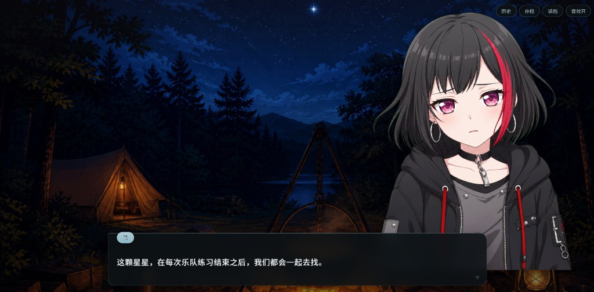
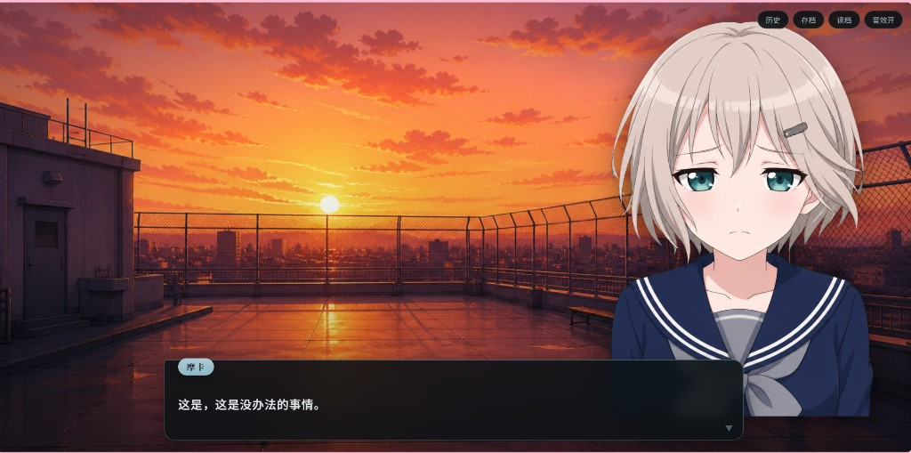
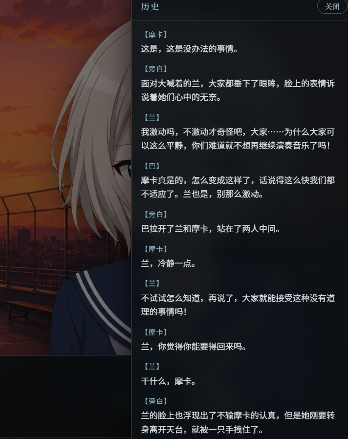

<div align="center">

# Word2Gal

English | [简体中文](./README.md)

> *A natural-language-driven visual novel Skill — turn a fanfic draft into a click-to-play HTML galgame.*

[](LICENSE)
[](skills/word2gal/SKILL.md)
[](skills/word2gal/templates/)

**Not a form filler — a full Agent workflow from story text to playable HTML.**

Ships a standard `SKILL.md`, player templates, and bake scripts. Use it with Cursor, Claude Code, Trae, Codex, Kimi Code, or any tool that supports Agent Skills.

[Prerequisites](#prerequisites) · [Recommended models](#recommended-models) · [Quick start](#quick-start) · [What you get](#what-you-get)

</div>

---

## Prerequisites

You only need the following (**no** Docker / Python venv):

| Need | Why |
|------|-----|
| An Agent Skills–capable app | Cursor, Claude Code, Trae, Codex, Kimi Code, etc., loading `skills/word2gal/` |
| **Node.js 18+** (with npm) | Script validate, greenscreen cut, bake |
| One `npm install` | Installs `pngjs` only (see command below) |
| Image-generation capable Agent/model | Sprites & backgrounds; without it you get weak placeholders |
| Network (recommended) | Look up character appearance; offline → text-only fallback |
| A modern browser | Play the baked HTML |

**Required once:**

```bash
cd skills/word2gal/scripts
npm install
```

This installs [`pngjs`](https://www.npmjs.com/package/pngjs) for `cut-sprite.mjs` / `check-sprite-alpha.mjs`.  
No other global package managers. The **output HTML has no frontend npm deps** — open it in a browser.

Bundled BGM (`music/sad.mp3` / `love.mp3`) ships with the Skill. If your Agent **cannot** generate short SFX, vocals stay silent; the story remains playable.

---

## Recommended models

Prefer models (or same-vendor stacks) that can **both orchestrate the Skill and generate images**. Sprite quality drives the experience; text-only setups are not recommended as your main choice.

| Tier | Pick from |
|------|-----------|
| International | **Gemini** (with Imagen / Nano Banana–class image), **GPT** (with GPT Image), Claude + built-in image tools (e.g. Cursor image gen) |
| China / CN stacks | **Qwen + Tongyi Wanxiang**, **Doubao / Jimeng (即梦)**, **Zhipu GLM + CogView / Qingying-class image**, **ERNIE + Wenxin Yige**, **Hunyuan** image, **Kolors** (when wired into your Agent) |

**How to choose:** stable chat + clear bust portraits, few face collapses; short SFX is a bonus (bundled BGM still works). Names change often — use whatever image capability your Agent can actually call.

---

## What it does

Give the Agent a natural-language story (characters, scenes, dialogue). It runs:

```text
Your story
    ↓ extract cast · scenes · dialogue/narration (verbatim)
    ↓ look up looks · emotion sprites · SFX / BGM
    ↓ bake player template
Playable HTML (open in a browser, click to advance)
```

You do **not** fill JSON, markup DSLs, or asset paths.

Good for fanfic web VNs, short galgame prototypes, and quick playtests.

---

## What you get

Open the generated HTML and you’ll see something like:

<div align="center">

| Camp night | Rooftop flashback |
|:---:|:---:|
|  |  |



<sub>Demo story *Morning Star*: stage sprites · speaker nameplate · history backlog<br />
Story source: [Bilibili opus](https://www.bilibili.com/opus/1100588492074778661)</sub>

</div>

| Capability | In the HTML |
|------------|-------------|
| Stage | Near-fullscreen: background + **dual left/right sprites** (active speaker highlighted) + dialogue box |
| History | Toolbar **History**: half-panel list of 【speaker】/【narration】 + read text |
| Sprites | Greenscreen cut by default; dirty plates must not ship; reuse `character-cards/` across chapters |
| Emotions | 3–5 expressions trimmed to story mood (not a fixed five-pack) |
| Text | Dialogue / narration / inner monologue stay **verbatim**; run `validate-coverage` before bake |
| SFX | Human vocals (laugh, sigh, …) + evidence-based light foley; no full-dialogue TTS |
| BGM | Melancholy → `sad`; sweet romance → `love` (`sad` wins) |
| UI themes | From `mood`: warm daily / bittersweet / tense / hotblood / comedy |
| Branches | Explicit either-or choices; deep multi-endings should be split by chapter |

Failed assets fall back to defaults / silence; the HTML must still be **playable**.

### Soft capacity per run

| Item | Sweet spot | Soft cap |
|------|------------|----------|
| Story length | ~800–2500 chars | ≤5000 / run |
| Sprite leads | 2–3 | ≤4 |
| Scenes | 1–3 | ≤5 |
| Expressions / cast | 3–4 | ≤5 |

Longer works: **split by chapter**, reuse sprites when possible.

---

## Quick start

After [Prerequisites](#prerequisites) and [Recommended models](#recommended-models):

### Install

1. Clone https://github.com/kiki3231/word2gal  
2. Copy (or symlink) **`skills/word2gal/`** into your Agent’s skills directory; keep the folder name `word2gal`  
3. Install script deps (**required** — cut/bake may fail without it):

```bash
cd skills/word2gal/scripts
npm install
```

4. Reload the Agent and pick a model stack with **image generation**  

| Tool | Typical path |
|------|----------------|
| Cursor | `<project>/.cursor/skills/word2gal/` |
| Claude Code | `<project>/.claude/skills/word2gal/` or `~/.claude/skills/word2gal/` |
| Trae / Codex / Kimi Code / others | Follow that product’s Agent Skills docs |

### Use

```text
Use Word2Gal to turn the following into a playable visual-novel HTML:

(paste your story here)
```

Output defaults to:

```text
output/<slug>/<Title>.html
output/<slug>/assets/
```

Open the HTML in a browser (BGM may start after the first click).

---

## What’s in the Skill

| Piece | Contents |
|-------|----------|
| **Workflow** | Extract → mood/SFX lists → character lookup → validate → assets → bake |
| **Player** | `player-basic.html` / `player-advanced.html` (vanilla HTML/CSS/JS) |
| **Themes** | 5 mood CSS packs |
| **Style pack** | `daily-heal` prompts + default placeholders |
| **BGM** | `music/sad.mp3`, `music/love.mp3` |
| **Scripts** | validate-script / validate-coverage / cut-sprite / check-alpha / bake-story |

---

## Agent workflow

1. Extract cast, scenes, beats, in-text branches  
2. Pick `mood`, expressions, vocal/foley, BGM  
3. Multi-image character check; lock age band & demeanor  
4. Compile script JSON → `validate-script.mjs` + `validate-coverage.mjs`  
5. Generate sprites / backgrounds / short SFX; write `speaker-map.json`  
6. Bake playable HTML (`--template basic|advanced`)  

Optional manual commands from the project root:

```bash
node skills/word2gal/scripts/validate-script.mjs <script.json>
node skills/word2gal/scripts/validate-coverage.mjs <source.txt> <script.json>
node skills/word2gal/scripts/cut-sprite.mjs --mode green --dir <assetsDir>
node skills/word2gal/scripts/check-sprite-alpha.mjs <assetsDir>
node skills/word2gal/scripts/bake-story.mjs <script.json> <assetsDir> <outDir>
# optional: … --template advanced
```

---

## BGM

| Key | File | When |
|-----|------|------|
| `sad` | `music/sad.mp3` | Melancholy / bittersweet parting, or `mood=bittersweet` |
| `love` | `music/love.mp3` | Romance / crush / confession — not mainly melancholy |

**Priority: `sad` > `love`.** See [`skills/word2gal/reference/bgm.md`](skills/word2gal/reference/bgm.md).

> Bundled tracks are demos; clear rights before redistributing.

---

## Layout

```text
word2gal/
├── README.md / README.en.md
├── LICENSE
├── media/demo/                  # README demo screenshots
└── skills/word2gal/
    ├── SKILL.md
    ├── reference/
    ├── scripts/
    ├── templates/
    ├── style-packs/daily-heal/
    └── music/
```

---

## Design principles

- Natural language only — no forms  
- Faithful dialogue/narration — split by pacing only  
- Greenscreen sprite cut by default — dirty plates must not ship; OC/NPC match in-story style  
- Vocals must sound human — no impact SFX as laughs/sighs  
- No full-dialogue TTS  
- History backlog with 【speaker】 + body text  

Full rules: [`skills/word2gal/SKILL.md`](skills/word2gal/SKILL.md).

---

## Tech stack

- **Output**: HTML5 + CSS3 + vanilla JavaScript  
- **Tooling**: Node.js (validate, cut, bake)  
- **Browsers**: modern Chrome / Firefox / Safari / Edge  

---

## Compatibility

- **Needs**: see [Prerequisites](#prerequisites) — especially Node + `npm install` and image generation  
- **Not guaranteed**: Agents without Skills, local scripts, or any image tools (output will look poor / placeholder-heavy)  

---

## License

[MIT License](LICENSE)

---

<div align="center">

**If this helps you, a Star ⭐ is appreciated.**

</div>
